title: 3dprinter
date: 2018-06-22 23:15:52
tags: [3Dprinter, ALUNAR, M508, Cura]

# 3DPrinterの設定について

## はじめ(目的)

### 1. 2台の3DPrinterのCura設定を記録する

* Alunar M508 From Amazon (約2万円)
* SmartRapCore ALU From Thingiverse By Myself (約2万円)

### 2. 3DPrinterについての雑談

## まず、Curaとはなにか
(CURA 15.04.6: https://ultimaker.com/en/products/ultimaker-cura-software/list)

### 1. Cura:スライシング用フリーソフト

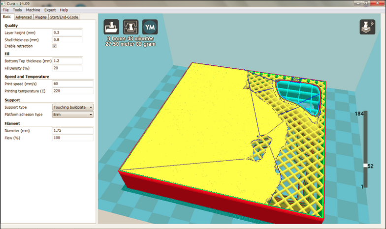  
(スライシング)

### 2. 何を設定するの?

* 3DPの印刷範囲
* 3DP印刷時、精度を上げる為の詳細設定(印刷速度、精度、温度など)

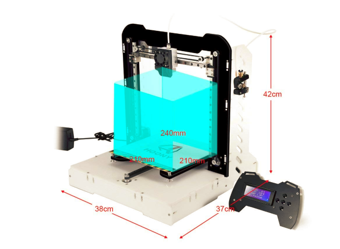  
(3DPの印刷範囲)

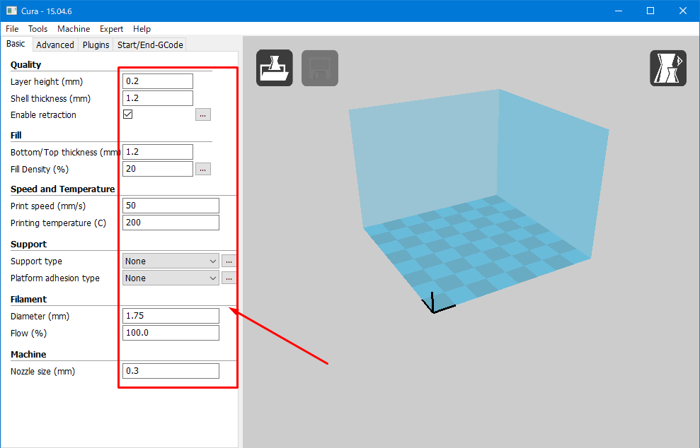  
印刷速度、精度、温度など

## Alunar M508(精密造形が目的)

### 1. 入手方法(Amazon.co.jp)

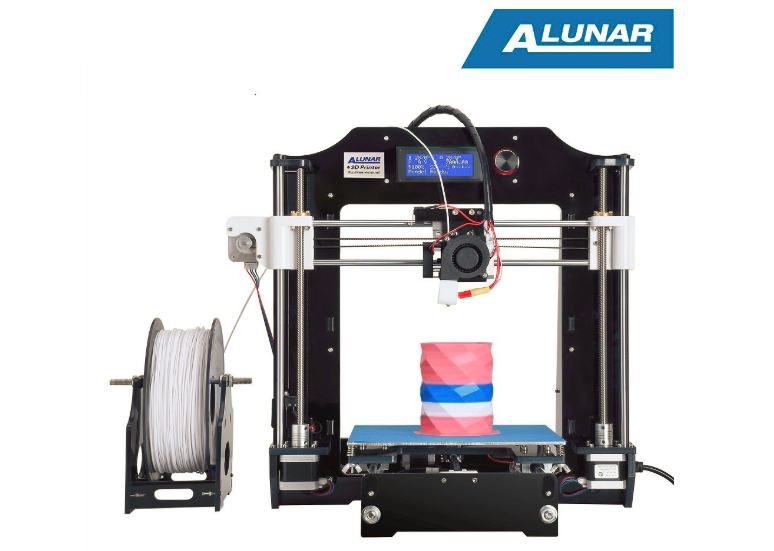  
ALUNAR-M508: http://amzn.asia/avTmjQN

### 2. Cura設定  
[M508－PLA.ini](M508－PLA.ini)

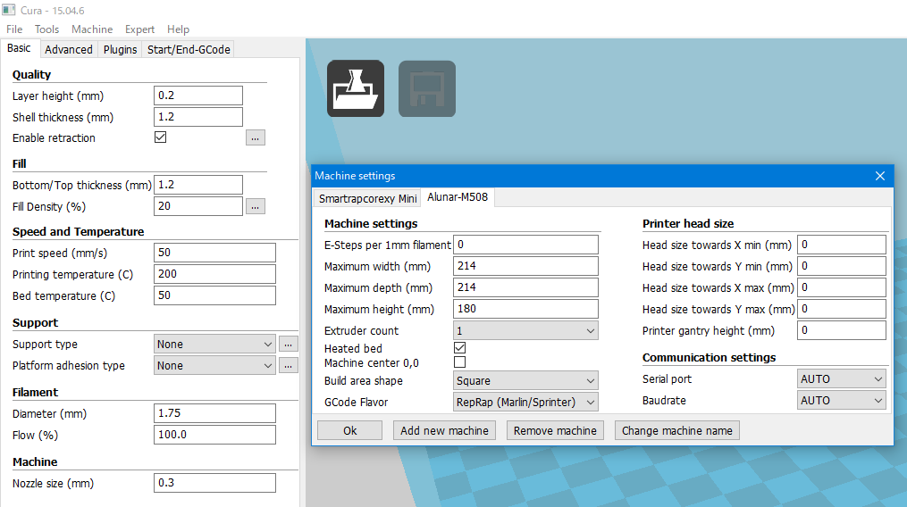

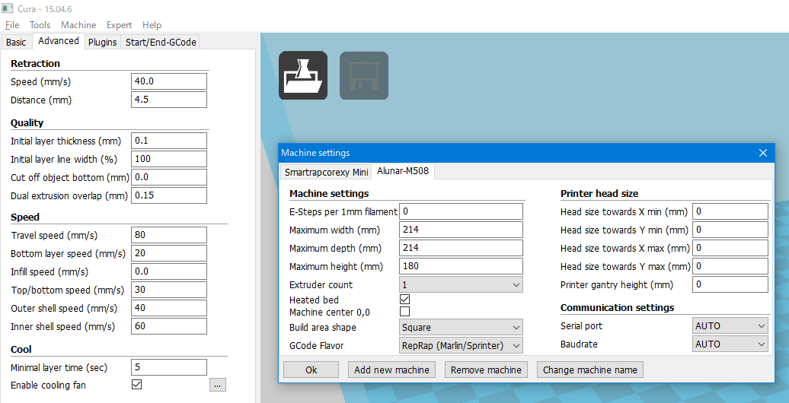

## SmartRapCore ALU(快速成形が目的)

### 1. 入手方法(Thingivers.com)

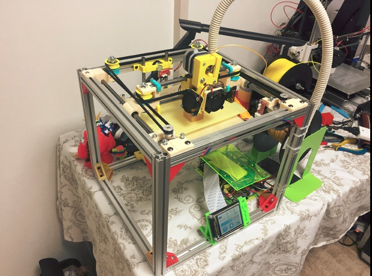  
Smartrapcore ALU

* Smartrapcore ALU本体: https://www.thingiverse.com/thing:1007070
* LM8UU用ヘットパーツ再設計: https://www.thingiverse.com/thing:2573516
* フィラメントホルダー: https://www.thingiverse.com/thing:2537713
* フィラメントホルダー: https://www.thingiverse.com/thing:2600605    

### 2. Cura設定  
[SmartCoreXY-Mini.ini](SmartCoreXY-Mini.ini)

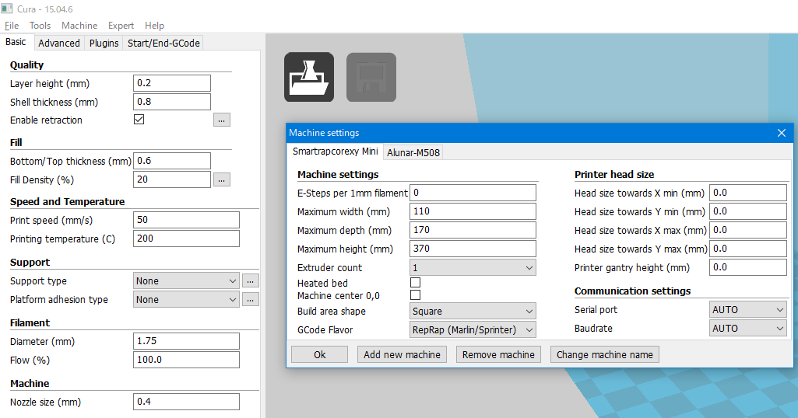

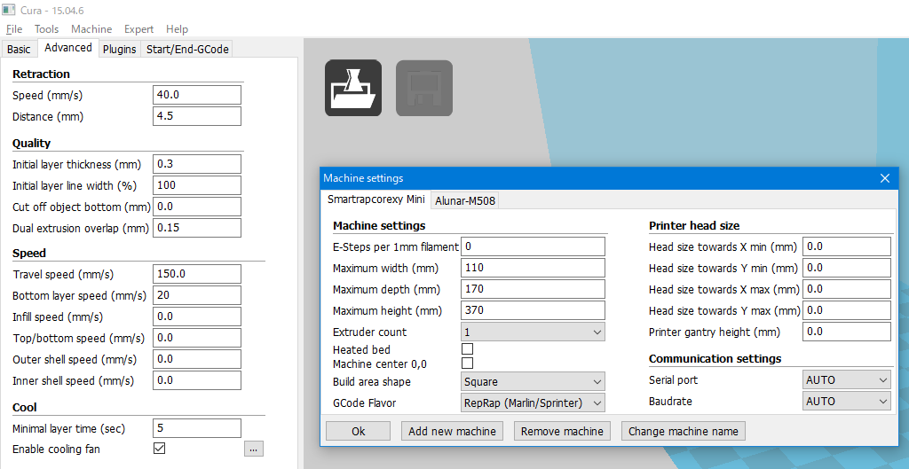  
(※調整する余地があります)

### 3.マザーボード購入について(赤兔ChiTu)

* ChiTu: http://www.cbd-3d.com/cn/prod/fdm.shtml

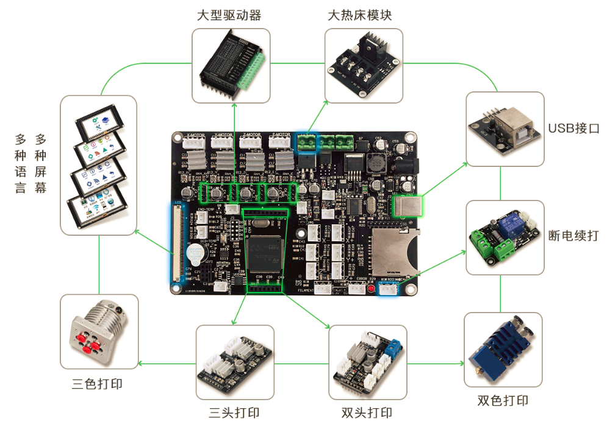

## 3DPrinterについての雑談: 3DP with Me

* 2013冬    スタート
* 2015      第一台3DPを設計・制作しました:KI
* 2016      第二台3DPを設計・制作しました:KII
* 2017      第一台CoreXY式3DPを制作しました

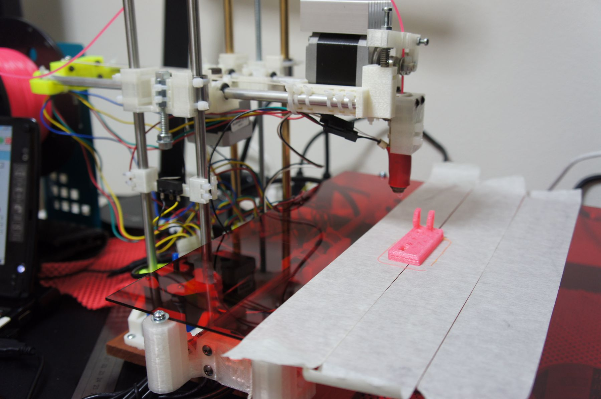  
(第一台3DPを設計・制作しました:KI)

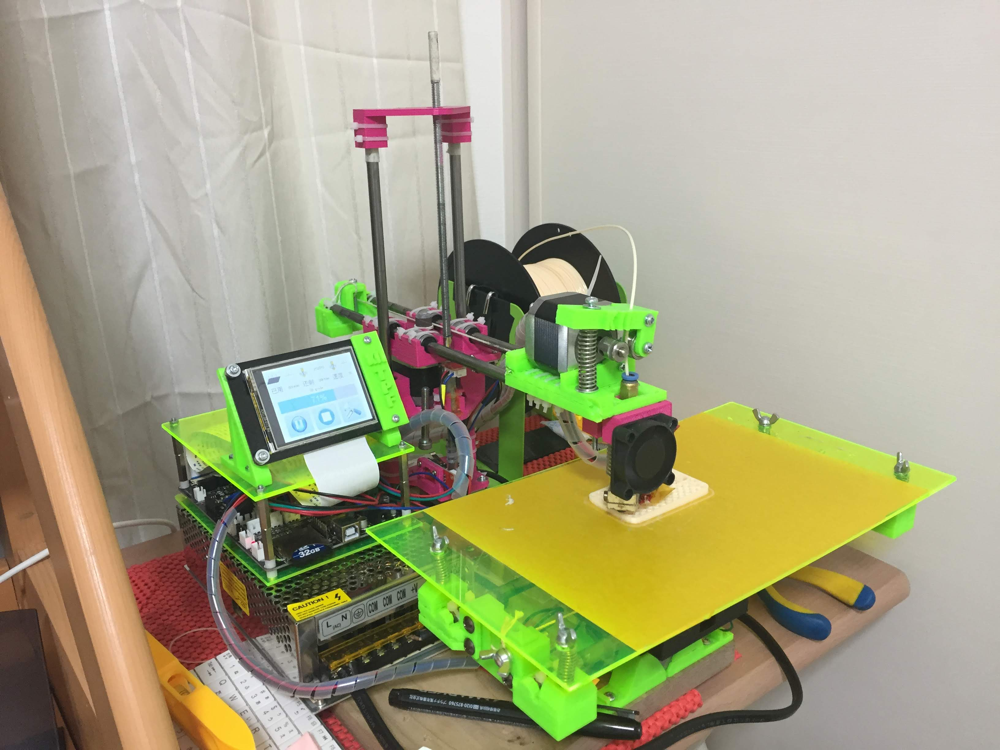  
(第二台3DPを設計・制作しました:KII)

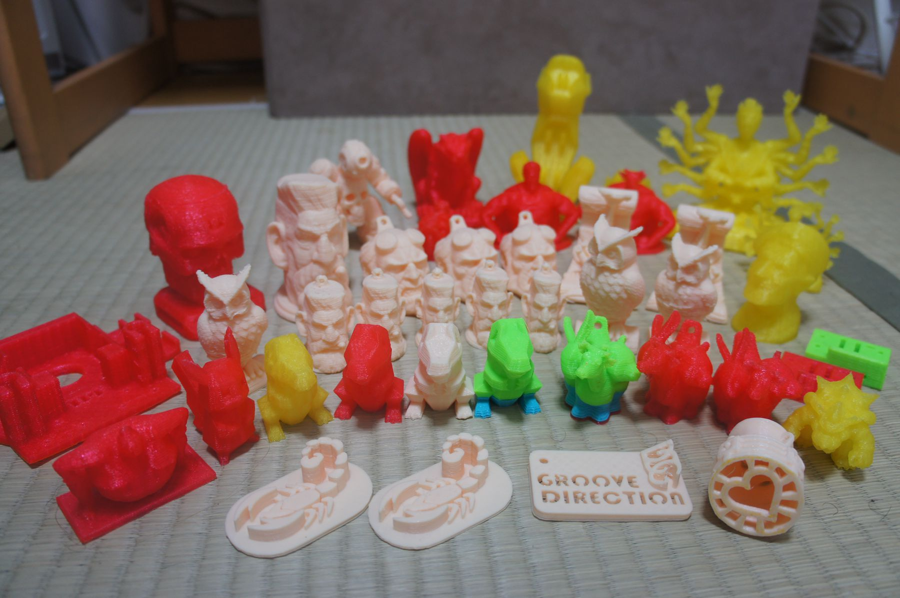
(KIIで作られたもの)

### What is CoreXY? and What other type of 3DP?

* XYZ軸独立方式
* Delta方式
* CoreXY方式

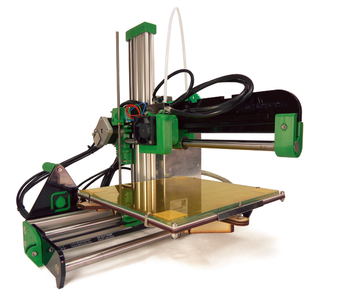  
(XYZ軸独立方式: https://reprap.org/wiki/Ormerod)

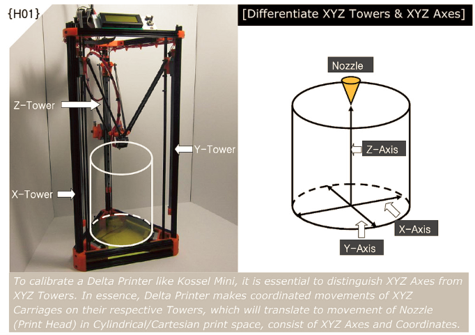  
(Delta方式: https://www.flickr.com/photos/deltarap/15264990135)

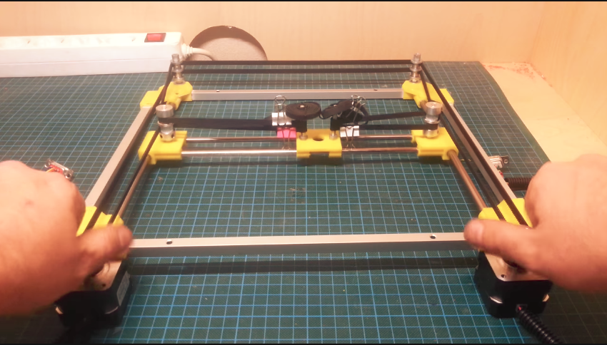  
(CoreXY方式:https://youtu.be/cdTB0t-0FW8)

詳しい説明はこちら: https://youtu.be/hqeGh-e6X3U

## これから

* 大型3DPはまだ未完成
* これからどうすればいいかな？

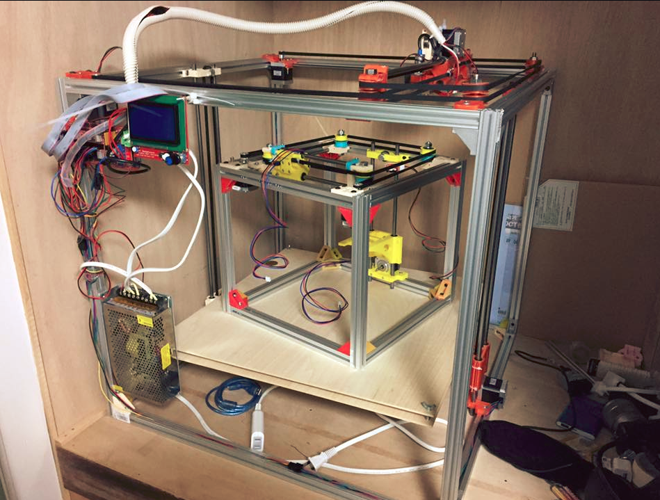

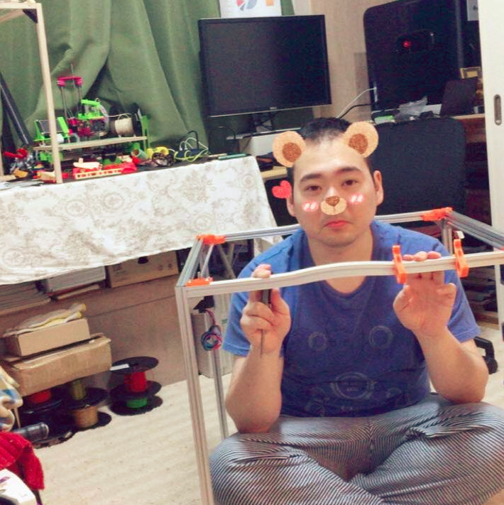